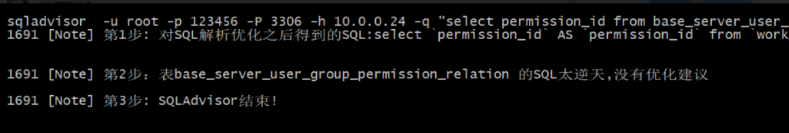

# SQLAdvisor说明

## 简介

SQLAdvisor是一个分析SQL给出索引优化建议的工具。它基于MySQL原生态词法解析，结合分析SQL中的where条件、聚合条件、多表Join关系 给出索引优化建议。

主要功能：输出SQL索引优化建议

详细介绍官方文档 : https://github.com/Meituan-Dianping/SQLAdvisor/blob/master/doc/THEORY_PRACTICES.md

## 安装依赖
centos版安装

```
#安装percona56 yum源，后续集成sqladvisor需要用到Percona客户端，优先安装避免与mysql客户端冲突。
yum install http://www.percona.com/downloads/percona-release/redhat/0.1-3/percona-release-0.1-3.noarch.rpm

yum -y install make cmake ncurses-devel gcc gcc-c++ openssl-devel libaio-devel libffi-devel glib2 glib2-devel m4 Percona-Server-shared-56 Percona-Server-client-56
```
## 安装使用

```
#编译依赖项sqlparser
git clone https://github.com/Meituan-Dianping/SQLAdvisor.git
cd SQLAdvisor
1.cmake -DBUILD_CONFIG=mysql_release -DCMAKE_BUILD_TYPE=debug -DCMAKE_INSTALL_PREFIX=/usr/local/sqlparser ./
2.make && make install

#安装SQLAdvisor源码
cd SQLAdvisor/sqladvisor/
cmake -DCMAKE_BUILD_TYPE=debug ./
make
cp sqladvisor  /usr/bin/

#使用帮助
sqladvisor  --help

#举个栗子
sqladvisor  -u root -p 123456 -P 3306 -h 10.0.0.24 -q "select permission_id from base_server_user_group_permission_relation;" -d work_permission_0 -v 1
```



* 编译完成后可删除整个sqladvisor目录，仅保留可执行文件sqladvisor。
