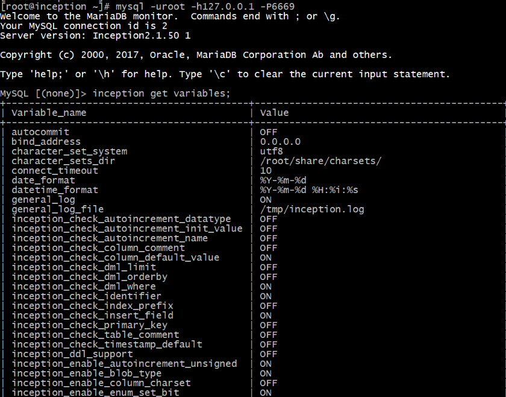
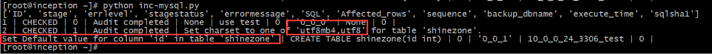
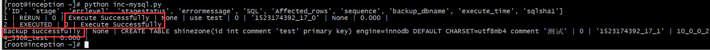
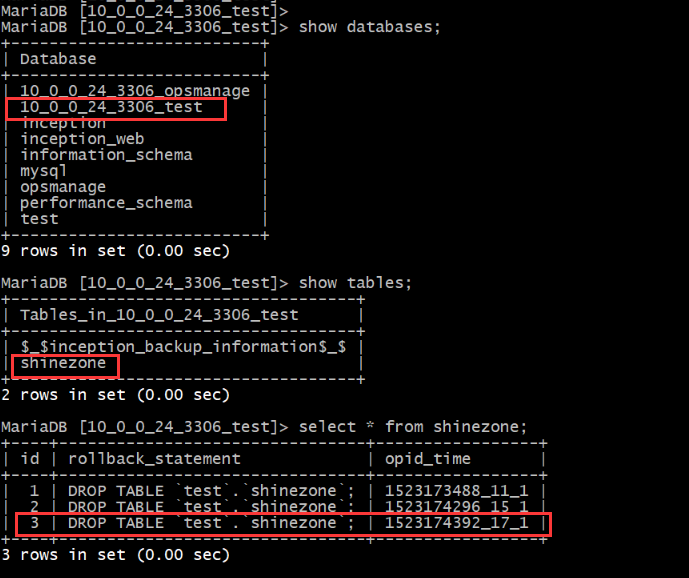
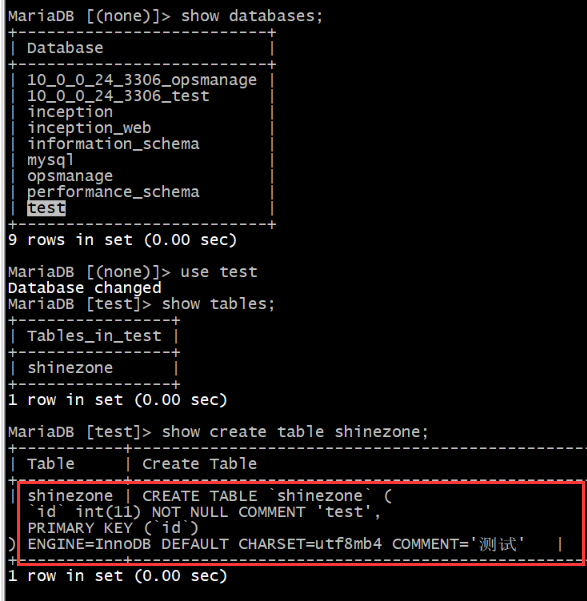

# Inception总述及体系结构

## 总述

Inception是集审核、执行、回滚于一体的一个自动化运维系统，它是根据MySQL代码修改过来的，用它可以很明确的，详细的，准确的审核MySQL的SQL语句，它的工作模式和MySQL完全相同，可以直接使用MySQL客户端来连接，但不需要验证权限，它相对应用程序（上层审核流程系统等）而言，是一个服务器，在连接时需要指定服务器地址及Inception服务器的端口即可，而它相对要审核或执行的语句所对应的线上MySQL服务器来说，是一个客户端，它在内部需要实时的连接数据库服务器来获取所需要的信息，或者直接在在线上执行相应的语句及获取binlog等，Inception就是一个中间性质的服务。图1.1所示为Inception的架构。

Inception提供的功能很丰富，首先，它可以对提交的所有语句的语法分析，如果语法有问题，都会将相应的错误信息返回给审核者。 还提供语义分析，当一个表，库，列等信息不正确或者不符合规范的时候报错，或者使用了一个不存在的对象时报错等等。 还提供了很多针对SQL规范性约束的功能，这些DBA都是可以通过系统参数来配置的。 更高级的功能是，可以辅助DBA分析一条查询语句的性能，如果没有使用索引或者某些原因导致查询很慢，都可以检查。

还提供SQL语句的执行功能，可执行的语句类型包括常用的DML及DDL语句及truncate table等操作。 Inception 在执行 DML 时还提供生成回滚语句的功能，对应的操作记录及回滚语句会被存储在备份机器上面，备份机器通过配置Inception参数来指定。


## 安装

centos版安装inception

```
#安装percona56 yum源，后续集成sqladvisor需要用到Percona客户端，优先安装避免与mysql客户端冲突。
yum install http://www.percona.com/downloads/percona-release/redhat/0.1-3/percona-release-0.1-3.noarch.rpm

yum -y install make cmake  ncurses-devel gcc gcc-c++ openssl-devel libaio-devel libffi-devel glib2 glib2-devel m4  Percona-Server-shared-56 Percona-Server-client-56

wget -c http://ftp.gnu.org/gnu/bison/bison-2.5.1.tar.gz
tar zxvf bison-2.5.1.tar.gz && cd bison-2.5.1 && ./configure && make && make install

cd /usr/local && wget -c https://github.com/mysql-inception/inception/archive/master.zip
unzip master.zip
cd inception-master/
sh inception_build.sh builddir linux
mv builddir/ /usr/local/inception-master_2.1.50

```

编译完成后，需要一个配置文件( inc.cnf ),此处只做示例用，详细配置参考官方说明：http://mysql-inception.github.io/inception-document/variables/

```
[inception]
general_log=1
general_log_file=inception.log
port=6669
socket=/自己目录，请自行修改/inc.socket
character-set-client-handshake=0
character-set-server=utf8
inception_remote_system_password=root
inception_remote_system_user=wzf1
inception_remote_backup_port=3306
inception_remote_backup_host=127.0.0.1
inception_support_charset=utf8mb4
inception_enable_nullable=0
inception_check_primary_key=1
inception_check_column_comment=1
inception_check_table_comment=1
inception_osc_min_table_size=1
inception_osc_bin_dir=/data/temp
inception_osc_chunk_time=0.1
inception_enable_blob_type=1
inception_check_column_default_value=1
```


## 启动，测试使用

```
#启动inception服务
nohup /usr/local/inception-master/builddir/mysql/bin/Inception --defaults-file=/etc/inc.cnf &

#通过mysql(percona)客户端连接
mysql -uroot -h127.0.0.1 -P6669

#测试命令，输出所有变量，如图1.2所示表示启动成功。
inception get variables;
```




## inc.cnf配置文件参数简要说明

```
[inception]
general_log=1
general_log_file=/var/log/inception.log
port=6669
socket=/tmp/inc.socket
character-set-client-handshake=0
character-set-server=utf8

#备份相关
#需要开启binlog
inception_remote_system_password=123456
inception_remote_system_user=user
inception_remote_backup_port=3306
inception_remote_backup_host=10.0.0.24

#在DML语句中没有WHERE条件时，是不是要报错
inception_check_dml_where=1
#在DML语句中使用了LIMIT时，是不是要报错
inception_check_dml_limit=1
#在DML语句中使用了Order By时，是不是要报错
inception_check_dml_orderby
#Select*时是不是要报错
inception_enable_select_star=1
#order by rand时是不是报错
inception_enable_orderby_rand=1
#创建或者新增列时如果列为NULL，是不是报错
inception_enable_nullable=1
#是不是支持外键
inception_enable_foreign_key=1
#一个索引中，列的最大个数，超过这个数目则报错(1-64)
inception_max_key_parts=5
#在一个修改语句中，预计影响的最大行数，超过这个数就报错(1-max)
inception_max_update_rows=10000
#一个表中，最大的索引数目，超过这个数则报错(1-1024)
inception_max_keys=16
#建表指定的存储引擎不为Innodb，不报错
inception_enable_not_innodb=0
#表示在建表或者建库时支持的字符集，如果需要多个，则用逗号分隔，影响的范围是建表、设置会话字符集、修改表字符集属性等
inception_support_charset=utf8mb4
#建表时，表没有注释时报错
inception_check_table_comment=1
#建表时，列没有注释时报错
inception_check_column_comment=1
#建表时，如果没有主键，则报错
inception_check_primary_key=1
#是不是支持分区表
inception_enable_partition_table=0
#是不是支持enum,set,bit数据类型
inception_enable_enum_set_bit=0
#是不是要检查索引名字前缀为"idx_"，检查唯一索引前缀是不是"uniq_"
inception_check_index_prefix=1
#自增列是不是要为无符号型
inception_enable_autoincrement_unsigned=1
#当char类型的长度大于这个值时，就提示将其转换为VARCHAR(1-max)
inception_max_char_length=16
#当建表时自增列的值指定的不为1，则报错
inception_check_autoincrement_init_value=1
#当建表时自增列的类型不为int或者bigint时报错
inception_check_autoincrement_datatype=1
#建表时，如果没有为timestamp类型指定默认值，则报错
inception_check_timestamp_default=0
#允许列自己设置字符集
inception_enable_column_charset=0
#建表时，如果指定的自增列的名字不为ID，则报错，说明是有意义的，给提示
inception_check_autoincrement_name=1
#在多个改同一个表的语句出现时，报错，提示合成一个
inception_merge_alter_table=1
#检查在建表、修改列、新增列时，新的列属性是不是要有默认值
inception_check_column_default_value=1
#检查是不是支持BLOB字段，包括建表、修改列、新增列操作
inception_enable_blob_type=1
#检查在SQL语句中，是不是有标识符被写成MySQL的关键字，默认值为报警。
inception_enable_identifer_keyword=1
#这个参数的作用是为了匹配Python客户端每次自动设置auto_commit=0的，如果取消则会报错，针对Inception本身没有实际意义
#auto_commit=0
#这个参数实际上就是MySQL数据库原来的参数，因为Incpetion没有权限验证过程，那么为了实现更安全的访问，可以给Inception服务器的这个参数设置某台机器（Inception上层的应用程序）不地址，这样
#其它非法程序是不可访问的，那么再加上Inception执行的选项中的用户名密码，对MySQL就更加安全
bind_address=127.0.0.1
#inception_user
#inception_password
#inception_enable_sql_statistic
#inception_read_only
#打开与关闭Inception对SQL语句中各种名字的检查，如果设置为ON，则如果发现名字中存在除数字字母下划线之外的字符时，报Identifier "invalidname" is invalid, valid options: [a-z,A-Z,0-9,_].
inception_check_identifier=1

#inception_osc_min_table_size=1
#inception_osc_bin_dir=/data/temp
#inception_osc_chunk_time=0.1
```


# Inception使用方法

1.  Inception规定，在语句的最开始位置，要加上inception_magic_start;语句，在执行语句块的最后加上inception_magic_commit;语句，这2个语句在 Inception 中都是合法的、具有标记性质的可被正确解析的 SQL 语句。被包围起来的所有需要审核或者执行的语句都必须要在每条之后加上分号，其实就是批量执行SQL语句。（包括use database语句之后也要加分号，这点与 MySQL 客户端不同），不然存在语法错误
2.  目前执行只支持通过C/C++接口、Python接口来对Inception访问，这一段必须是一次性的通过执行接口提交给Inception，那么在处理完成之后，Inception会返回一个结果集，来告诉我们这些语句中存在什么错误，或者是完全正常等等。

下面是一个python脚本访问inception的简单例子，指定连接测试的mysql服务器为10.0.0.24：

```
cat >inc-mysql.py <<EOF
#!/usr/bin/env python
#coding=utf8
import MySQLdb
sql='''/*--user=root;--password=123456;--host=10.0.0.24;--execute=1;--port=3306;*/\
    inception_magic_start;\
    use test;\
    CREATE TABLE shinezone(id int);\
    inception_magic_commit;'''
#print sql
try:
        conn=MySQLdb.connect(host='127.0.0.1',user='',passwd='',db='',port=6669)
        cur=conn.cursor()
        ret=cur.execute(sql)
        result=cur.fetchall()
        num_fields = len(cur.description)
        field_names = [i[0] for i in cur.description]
        print field_names
        for row in result:
                print row[0], "|",row[1],"|",row[2],"|",row[3],"|",row[4],"|",row[5],"|",row[6],"|",row[7],"|",row[8],"|",row[9],"|",row[10]
        cur.close()
        conn.close()
except MySQLdb.Error,e:
             print "Mysql Error %d: %s" % (e.args[0], e.args[1])
EOF
```

执行脚本

```
python inc-mysql.py
```

输出如图1.3，提示先前建表语句不规范处.




更改建表语句:

CREATE TABLE shinezone(id int comment 'test' primary key) engine=innodb DEFAULT CHARSET=utf8mb4 comment '测试';\

```
cat >inc-mysql.py <<EOF
#!/usr/bin/env python
#coding=utf8
import MySQLdb
sql='''/*--user=root;--password=123456;--host=10.0.0.24;--execute=1;--port=3306;*/\
    inception_magic_start;\
    use test;\
    CREATE TABLE shinezone(id int comment 'test' primary key) engine=innodb DEFAULT CHARSET=utf8mb4 comment '测试';\
    inception_magic_commit;'''
#print sql
try:
        conn=MySQLdb.connect(host='127.0.0.1',user='',passwd='',db='',port=6669)
        cur=conn.cursor()
        ret=cur.execute(sql)
        result=cur.fetchall()
        num_fields = len(cur.description)
        field_names = [i[0] for i in cur.description]
        print field_names
        for row in result:
                print row[0], "|",row[1],"|",row[2],"|",row[3],"|",row[4],"|",row[5],"|",row[6],"|",row[7],"|",row[8],"|",row[9],"|",row[10]
        cur.close()
        conn.close()
except MySQLdb.Error,e:
             print "Mysql Error %d: %s" % (e.args[0], e.args[1])
EOF
```

再执行下脚本，图1.4提示建表成功，同时生成回滚语句，记录在inception备份库中.




备份机器的库名组成是由线上机器的 IP 地址的点换成下划线，再加上端口号，再加上库名三部分，图1.5为以上实验生成的备份,可以看到inception自动生成的回滚语句DROP TABLE...




至此，inception完成sql语句的审核备份上线流程。




# Inception 对线上配置需求

1. 线上服务器必须要打开 binlog，在启动时需要设置参数log_bin、log_bin_index等关于 binlog 的参数。不然不会备份及生成回滚语句。
2. 参数binlog_format必须要设置为 mixed 或者 row 模式，通过语句： set global binlog_format=mixed/row 来设置，如果是 statement 模式，则不做备份及回滚语句的生成。
3. 参数 server_id 必须要设置为非0及非1，通过语句：set global server_id=server_id;来设置，不然在备份时会报错。
4. 线上服务器一定要有指定用户名的权限，这个是在语句前面的注释中指定的，做什么操作就要有什么权限，否则还是会报错，如果需要执行的功能，则要有线上执行语句的权限，比如DDL及DML，同时如果要执行inception show 等远程命令的话，有些语句是需要特殊权限的，这些权限也是需要授予的，关于权限这个问题，因为一般Inception是运行在一台固定机器上面的，那么在选项中指定的用户名密码，实际上是Inception机器对线上数据库访问的权限，所以建议在使用过程中，使用专门固定的帐号来让Inception使用，最好是一个只读一个可写的即可，这样在执行时用可写，审核或者查看线上状态或者表库结果时用只读即可，这样更安全。
5. 在执行时，不能将 DML 语句及 DDL 语句放在一起执行，否则会因为备份解析binlog时由于表结构的变化出现不可预知的错误，如果要有同时执行 DML 及 DDL，则请分开多个语句块儿来执行，如果真的这样做了，Inception 会报错，不会去执行。

