# 代码质量管理平台SonarQube

## 简介

SonarQube 是一个开源的代码分析平台, 用来持续分析和评测项目源代码的质量。 通过SonarQube我们可以检测出项目中重复代码， 潜在bug， 代码风格问题，缺乏单元测试等问题， 并通过一个web ui展示出来。

**SonarQube的架构**

- Database
- SonarQube Server
- SonarQube Scanner
- Project
- Nginx （如果不需要通过nginx转发则不需要Nginx模块）

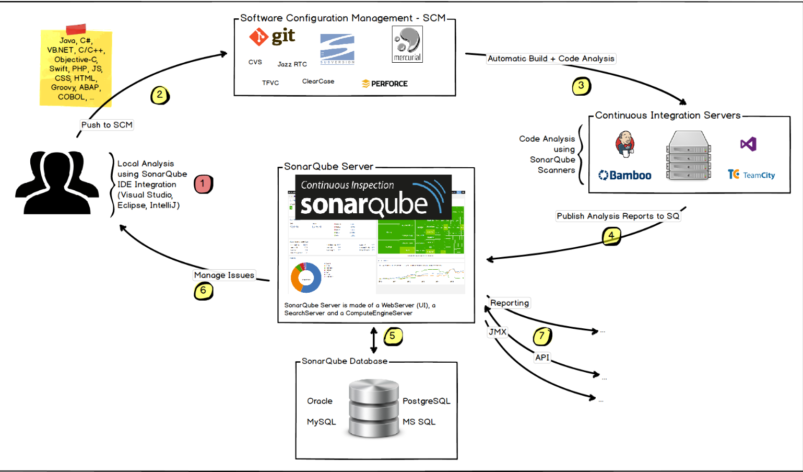


## SonarQube服务端

创建sonarqube镜像

```
cat > Dockerfile <<EOF
FROM openjdk:8-alpine

ENV SONAR_VERSION=7.3 \
    SONARQUBE_HOME=/opt/sonarqube \
    # Database configuration
    # Defaults to using H2
    SONARQUBE_JDBC_USERNAME=sonar \
    SONARQUBE_JDBC_PASSWORD=sonar \
    SONARQUBE_JDBC_URL=

# Http port
EXPOSE 9000

RUN addgroup -S sonarqube && adduser -S -G sonarqube sonarqube

RUN set -x \
    && apk add --no-cache gnupg unzip \
    && apk add --no-cache libressl wget \
    && apk add --no-cache su-exec \
    && apk add --no-cache bash \

    # pub   2048R/D26468DE 2015-05-25
    #       Key fingerprint = F118 2E81 C792 9289 21DB  CAB4 CFCA 4A29 D264 68DE
    # uid                  sonarsource_deployer (Sonarsource Deployer) <infra@sonarsource.com>
    # sub   2048R/06855C1D 2015-05-25
    && gpg --keyserver ha.pool.sks-keyservers.net --recv-keys F1182E81C792928921DBCAB4CFCA4A29D26468DE \

    && mkdir /opt \
    && cd /opt \
    && wget -O sonarqube.zip --no-verbose https://sonarsource.bintray.com/Distribution/sonarqube/sonarqube-$SONAR_VERSION.zip \
    && wget -O sonarqube.zip.asc --no-verbose https://sonarsource.bintray.com/Distribution/sonarqube/sonarqube-$SONAR_VERSION.zip.asc \
    && gpg --batch --verify sonarqube.zip.asc sonarqube.zip \
    && unzip sonarqube.zip \
    && mv sonarqube-$SONAR_VERSION sonarqube \
    && chown -R sonarqube:sonarqube sonarqube \
    && rm sonarqube.zip* \
    && rm -rf $SONARQUBE_HOME/bin/*

VOLUME "$SONARQUBE_HOME/data"

WORKDIR $SONARQUBE_HOME
COPY run.sh $SONARQUBE_HOME/bin/
ENTRYPOINT ["./bin/run.sh"]
EOF

cat > run.sh <<EOF
#!/bin/sh

set -e

if [ "${1:0:1}" != '-' ]; then
  exec "$@"
fi

chown -R sonarqube:sonarqube $SONARQUBE_HOME
exec su-exec sonarqube \
  java -jar lib/sonar-application-$SONAR_VERSION.jar \
  -Dsonar.log.console=true \
  -Dsonar.jdbc.username="$SONARQUBE_JDBC_USERNAME" \
  -Dsonar.jdbc.password="$SONARQUBE_JDBC_PASSWORD" \
  -Dsonar.jdbc.url="$SONARQUBE_JDBC_URL" \
  -Dsonar.web.javaAdditionalOpts="$SONARQUBE_WEB_JVM_OPTS -Djava.security.egd=file:/dev/./urandom" \
  "$@"
EOF

chmod +x run.sh
docker build -t sonarqube:shenshuo .
```


直接通过当前的docker镜像启动服务（docker、docker-compose安装此处略过。）

```
mkdir -p /data/sonarqube/

cat >/data/sonarqube/docker-compose.yml <<EOF
version: "2"

services:
  sonarqube:
    image: sonarqube:shenshuo
    ports:
      - "9000:9000"
    networks:
      - sonarnet
    environment:
      - SONARQUBE_JDBC_URL=jdbc:postgresql://db:5432/sonar
    volumes:
      - /data/sonarqube/conf:/opt/sonarqube/conf
      - /data/sonarqube/data:/opt/sonarqube/data
      - /data/sonarqube/extensions:/opt/sonarqube/extensions
      - /data/sonarqube/bundled-plugins:/opt/sonarqube/lib/bundled-plugins

  db:
    image: postgres
    networks:
      - sonarnet
    environment:
      - POSTGRES_USER=sonar
      - POSTGRES_PASSWORD=sonar
    volumes:
      - postgresql:/var/lib/postgresql
      - postgresql_data:/var/lib/postgresql/data

networks:
  sonarnet:
    driver: bridge

volumes:
  postgresql:
  postgresql_data:
EOF

cd /data/sonarqube
docker-compose up -d
```

启动docker后访问ip:9000，代表服务已启动,默认登录密码admin/admin


**SonarQube配置安装插件，汉化。**


如图进入marketplace，搜索汉化包,各类语言代码扫描依赖包， 安装完毕后自动重启。


接下来开始配置sonarqube服务全局配置。


**主要配置项：**

- Server base URL

  定义sonar服务访问地址，可用域名或ip

- Email prefix

  发送邮件时的主题前缀

- From address

- From name

- Secure connection

  smtp安全协议

- SMTP host

- SMTP password

- SMTP port

配置完成后测试发送


**配置邮件提醒**

在 我的账号-提醒 下设置邮件提醒，也可针对特定项目设置提醒，发送邮件。


至此sonarqube服务端安装配置全部已完成。


## SonarQube客户端

配置好sonar的服务端之后，接下来就要使用sonar检测我们的代码了，sonar主要是借助客户端检测工具来检测代码，所以要使用sonar必须要在我们本地配置好客户端检测工具

客户端可以通过IDE插件、Sonar-Scanner插件、Ant插件和Maven插件方式进行扫描分析，此处使用的是Sonar-Scanner,sonar的命令行分析端软件还有Sonar-Runner,和Scanner使用差不多

此处我们使用sonar-scanner

```shell
wget https://sonarsource.bintray.com/Distribution/sonar-scanner-cli/sonar-scanner-cli-3.2.0.1227-linux.zip
unzip  sonar-scanner-cli-3.2.0.1227-linux.zip
mv sonar-scanner-3.2.0.1227-linux/ /usr/local/sonar-scanner
export SONAR_RUNNER_HOME=/usr/local/sonar-scanner
export PATH=$SONAR_RUNNER_HOME/bin:$PATH
```

修改sonar-scanner配置文件,只需配置sonarqube服务端地址，打开encoding注释即可。

```
vim /usr/local/sonar-scanner/conf/sonar-scanner.properties 
```

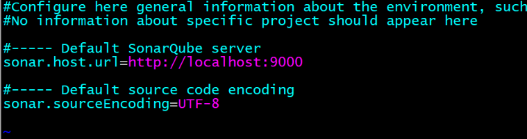


## 使用sonar-scanner扫描项目代码

拉取个python项目

```shell
cd /data/
git clone https://github.com/ss1917/do_cron.git
```

在要检测的项目根目录下新建sonar-project.properties，内容如下：

```
cat >sonar-project.properties<<EOF
sonar.projectKey=ops:project
sonar.projectName=do_cron
sonar.projectVersion=1.0
sonar.sources=.
EOF
```

在当前项目根目录下运行sonar-scanner开始扫描

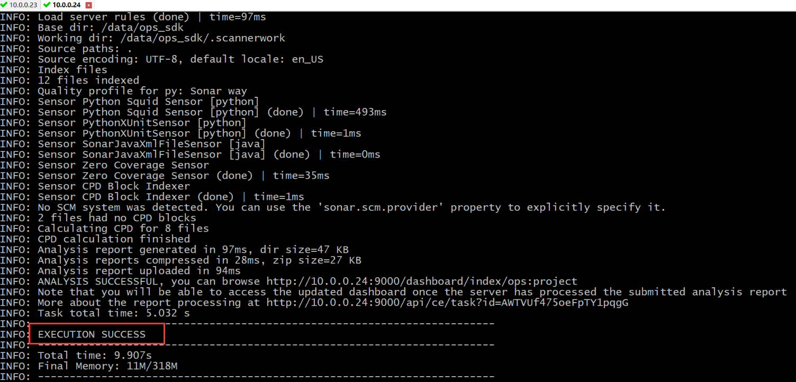

无报错，有输出成功日志。

访问sonarqube web页面查看扫描结果

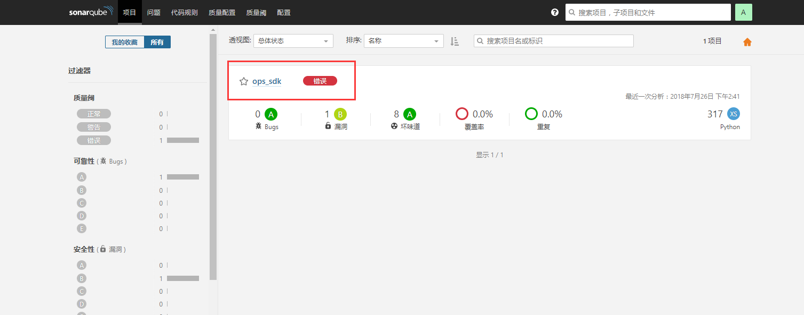

同时邮箱也接收到扫描结果邮件

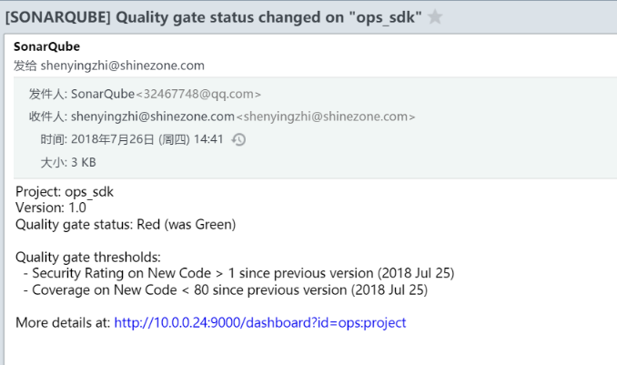


## 以上为安装部署， 此项目可以使用sonar对接自动化

如图示：

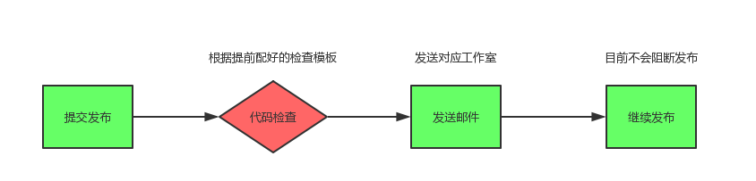

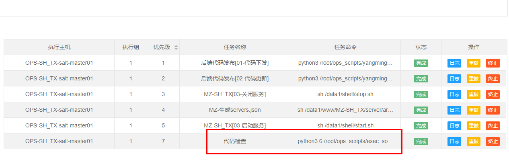


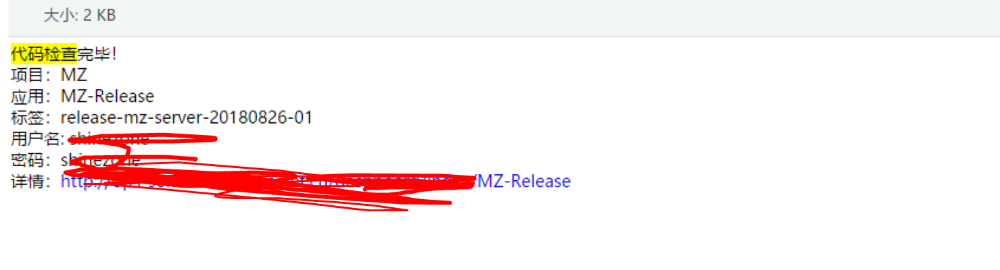

> 此任务放在最后一个并且检查是否有重大BUG 都不会影响发布，如果需要根据条件阻断发布，在任务编排中放在 前列，并且抛出错误，则任务进程会报错等待处理。

## gitlab-plugin 配合 gitlab-ci 完成每次 commit 代码检测 (这样对gitlab资源消耗比较严重，且配置复杂，此处仅供参考)

### Sonar GitLab Plugin 安装

sonar应用市场搜索gitlab，安装.

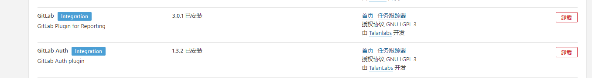

### gitlab-runner安装

测试环境gitlab ci为10.8.4版本，需下载匹配版本的gitlab-runner

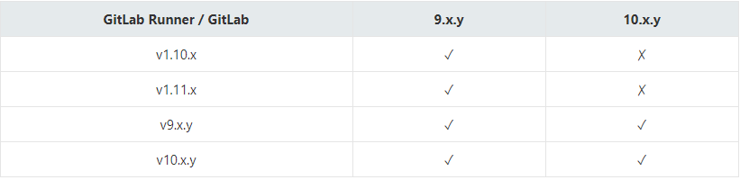

**安装**

```
sudo wget -O /usr/bin/gitlab-runner https://gitlab-ci-multi-runner-downloads.s3.amazonaws.com/latest/binaries/gitlab-ci-multi-runner-linux-amd64
chmod +x /usr/bin/gitlab-runner
sudo gitlab-runner install --user=gitlab-runner --working-directory=/home/gitlab-runner

#向gitlab注册runner
gitlab-runner register
```

```shell
Running in system-mode.                            
                                                   
Please enter the gitlab-ci coordinator URL (e.g. https://gitlab.com/):
http://gitlab.example.com/
Please enter the gitlab-ci token for this runner:
deap7yTbt-J35euZzek9
Please enter the gitlab-ci description for this runner:
[localhost.localdomain]: my-test-runner
Please enter the gitlab-ci tags for this runner (comma separated):
my-test
Whether to run untagged builds [true/false]:
[false]: true
Whether to lock Runner to current project [true/false]:
[false]: true
Registering runner... succeeded                     runner=deap7yTb
Please enter the executor: ssh, docker-ssh+machine, shell, virtualbox, docker+machine, kubernetes, docker, docker-ssh, parallels:
shell
Runner registered successfully. Feel free to start it, but if it's running already the config should be automatically reloaded!
```

注册时需要的token来自gitlab-Admin Area-Runners。注册成功后启动`gitlab-runner start`

可以看到gitlab  runners界面中出现了runner

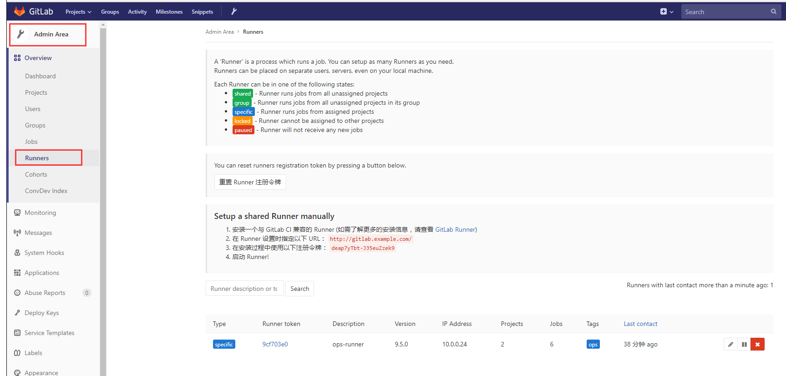

### runner配合sonar-scanner实现代码commit后自动扫描

编写个简单脚本，完成2件事情，拉取指定项目，进入项目目录执行sonar-scanner扫描代码

```shell
#!/bin/bash
if [ $# -ne 2 ]
then
        echo "arguments error!"
        exit 1
else
        deploy_path="/data/$1/$2"
        if [ ! -d "$deploy_path" ]
        then
                project_path="git@gitlab.example.com:"$1/$2".git"
                git clone $project_path $deploy_path
        else
                cd $deploy_path
                git pull
        fi
fi

cd $deploy_path;sonar-scanner
if [ $? -eq 0 ]; then
        echo "sonarqube code-analyze over."
fi
```

编写`.gitlab-ci.yml`配置文件，放入指定项目仓库根目录

```
cat >gitlab-ci.yml <<EOF
stages:
  - deploy
deploy:
    stage: deploy
    script:
      - /data/shell/sonar_analyze.sh root php-test
    only:
      - master
EOF
```

- 此处`root` `php-test`2个参数含义为指向测试环境gitlab项目git@gitlab.example.com:root/php-test.git
- `only master`表示仅对master分支生效


**尝试一下修改项目任意一处push后是否触发自动扫描**

```
git add .
git commit -m "modify sonar-project.properties"
#[master 0559cb1] modify sonar-project.properties
#3 files changed, 3 insertions(+), 5 deletions(-)
git push origin master
```

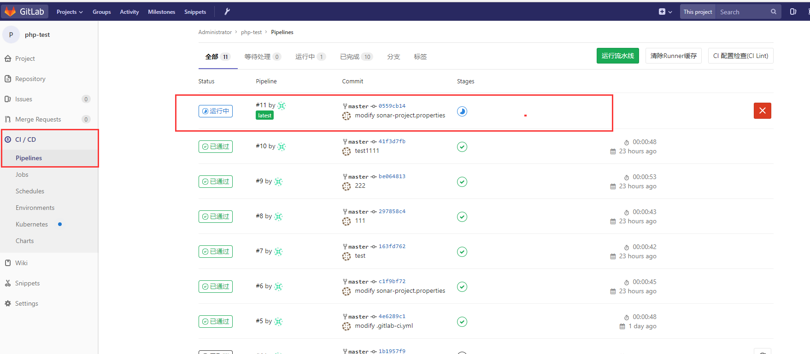

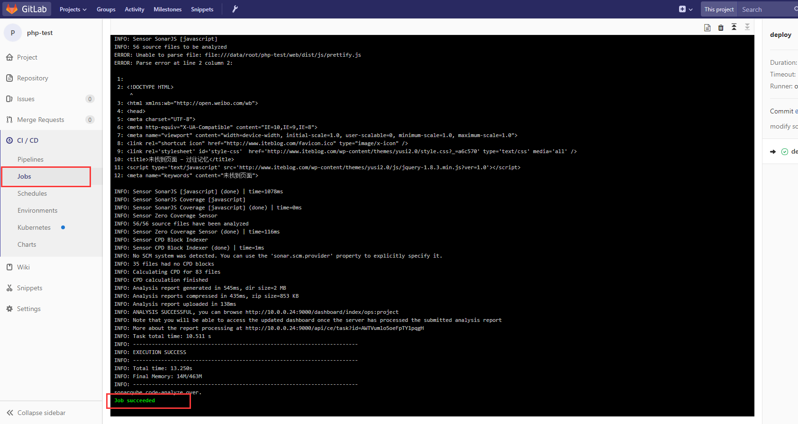

任务成功完成，同时邮箱收到扫描报告

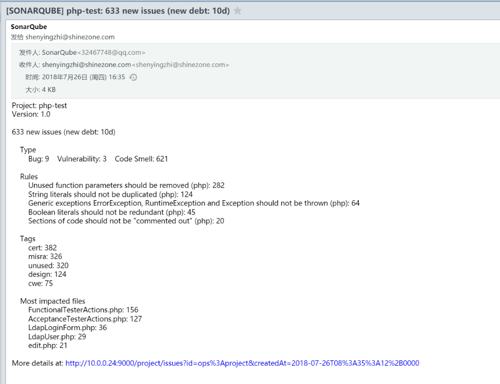

点击邮件中的链接，跳转到详细扫描结果页面。

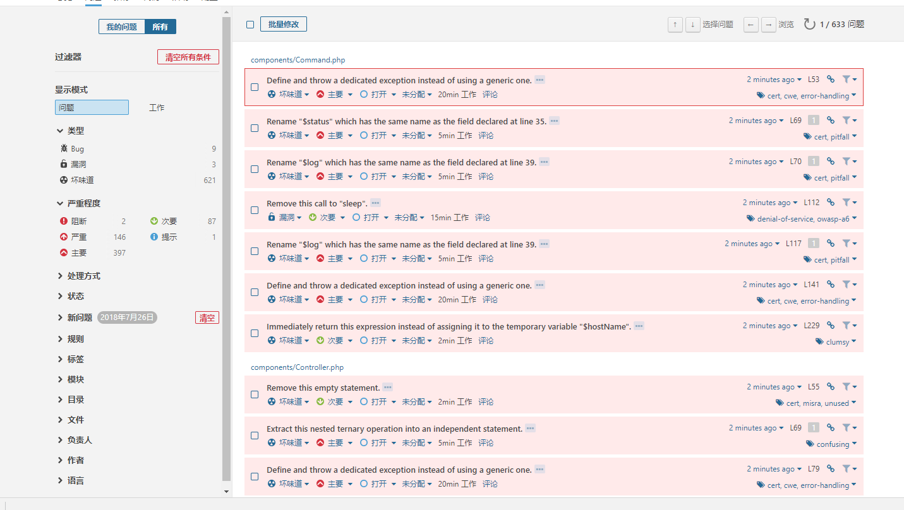